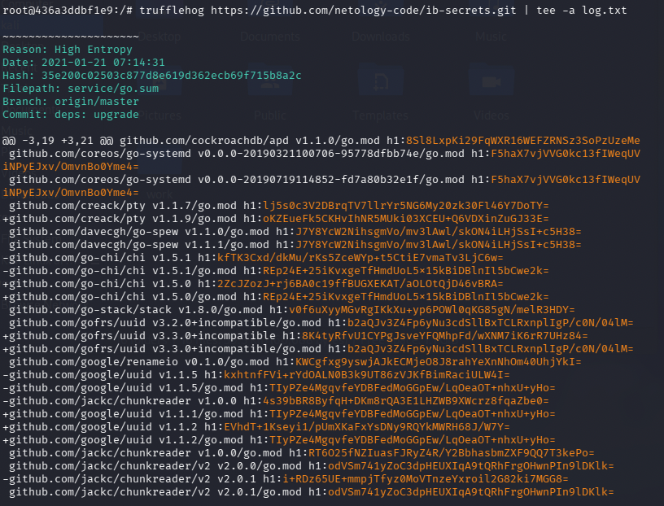
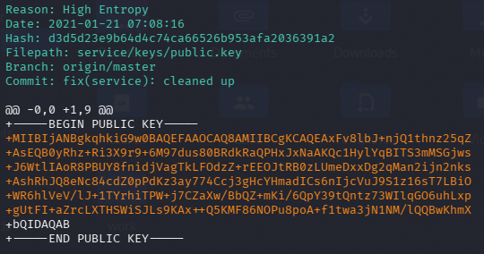
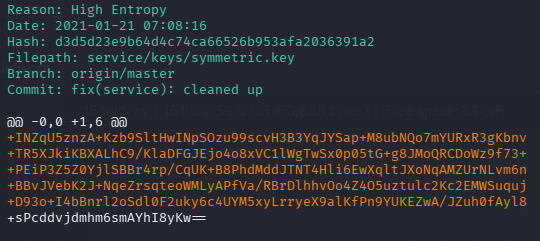
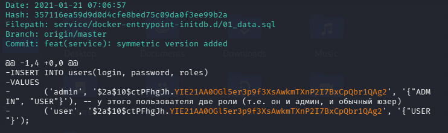
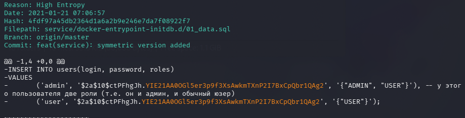

# Домашнее задание к занятию «1.3. Системы контроля версий и CI/CD»

---

## Задание truffleHog

### Описание задания

Инструмент truffleHog умеет искать по всей истории проекта «секреты». 
Если проект использует git.
В этой работе будет применен truffleHog для наглядного примера ложных срабатываний и его применения 
для удобства коммуникации с разработчиками по логам.

### Результаты выполнения

- Создаем и запускаем изолированный контейнер на базе образа python:buster с пробросом сетевого порта 
командой `docker run -it -p 8080:8080 python:buster /bin/bash`

- Устанавливаем truffleHog `pip install truffleHog`

- Далее выполняем анализ [репозитория](https://github.com/netology-code/ib-secrets)  с помощью инструмента truffleHog 
`trufflehog https://github.com/netology-code/ib-secrets.git | tee -a log.txt` 

- Получаем [лог результатов сканирования](./screens/log.txt)

Фрагмент вывода сканирования:

Найденные секреты с кратким описанием:

- `service/keys/private.key`
Приватный RSA-ключ, утечка которого позволит расшифровать защищенные данные.
Критическая уязвимость.

- `service/keys/public.key`
Публичный ключ, проверяет подпись и используется для шифрования. 
При сочетании с приватным ключем делает систему уязвимой.

- `service/keys/symmetric.key`
Симметричный ключ используется для шифрования и расшифровки данных. Механизмы защиты становятся неэффективными.

- `service/docker-entrypoint-initdb.d/01_data.sql`
Файл с данными пользователей - логины, хэши паролей и роли.
Критическая угроза безопасности системы.

## Задание BFG Repo-Cleaner

### Описание задания

Проверка после удаления разработчиками "чувствительных данных" [репозитория](https://github.com/netology-code/ib-secrets-fixed)

### Результаты выполнения

- Снова запускаем truffleHog командой `trufflehog https://github.com/netology-code/ib-secrets-fixed.git | tee log_fixed.txt`

- Получаем [лог результатов сканирования](./screens/log_fixed.txt)

- После анализа лога выявлено, что не все секреты были удалены - учетные данные остались:

