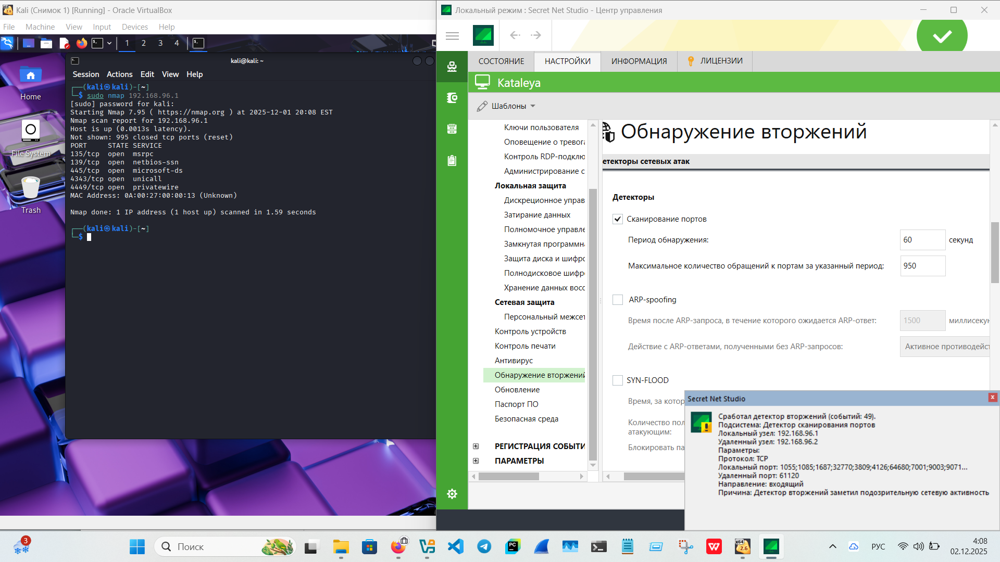
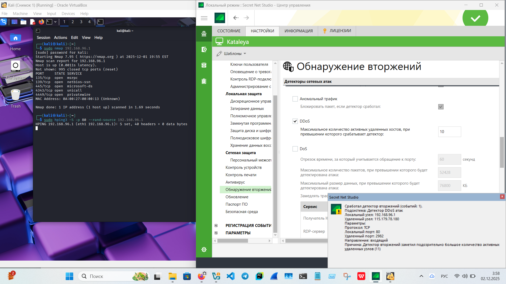
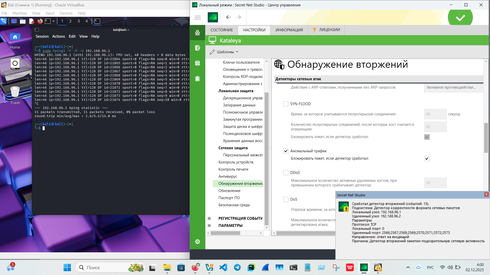
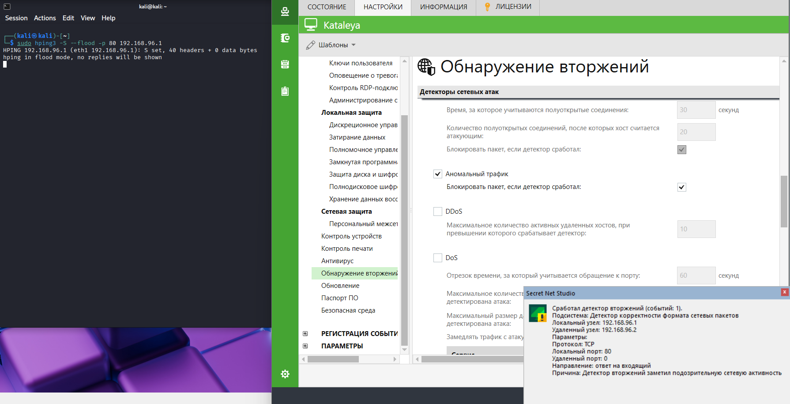
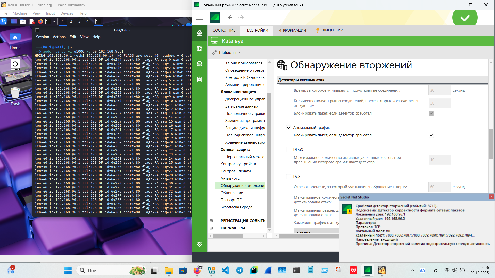

# «Intrusion Detection/Intrusion Prevention Systems (IDS/IPS)»

---
  
## IDS/IPS  
  
IDS/IPS - системы безопасности для защиты компьютерных сетей от атак и вредоностных активностей.  
  
- IDS - система обнаружения вторжений.  
Обнаруживает подозрительную активность, но не блокирует.  
  
- IPS - система предотвращения вторжений.  
Обнаруживает и сразу блокирует атаки.
    
### Описание задания  
  
 1. Сканирование портов.  
  
 2. Имитация DDos атаки.  
  
 3. Имитация аномального трафика.  
  
  
### Результаты выполнения  
  
 1. Сканирование портов.
  
- Просканированы порты ОС Windows 11 с помощью развернутой виртуальной машины Kali Linux командой  
`sudo nmap <ip-адрес>`.  
«Максимальное количество обращений к портам за указанный период» - 950:

 2. Имитация DDos атаки.  
  
- Провелась имитация DDos атаки командой `sudo hping3 -S -p 80 --rand-source <ip-адрес>`.  
«Максимальное количество активных удаленных хостов, при превышении которого срабатывает детектор» - 10:

 3. Имитация аномального трафика.  
  
- Для имитации аномального трафика были использованы команды:  
  
`sudo hping3 -F -P -U <ip-адрес>` - отправка несовместимых TCP пакетов, что идентифицируется как аномальный трафик.  
  
`sudo hping3 -S --flood -p 80 <ip-адрес>` - отправка огромного количества SYN-пакетов с очень высокой скоростью.  
  
`sudo hping3 -i u1000 -p 80 <ip-адрес>` - отправка TCP пакетов с очень высокой скоростью.  
  

