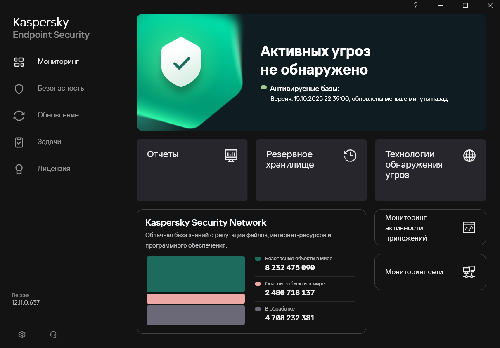
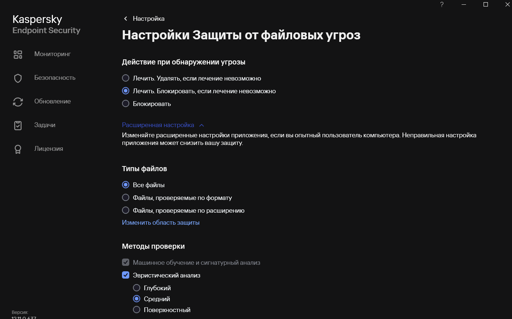
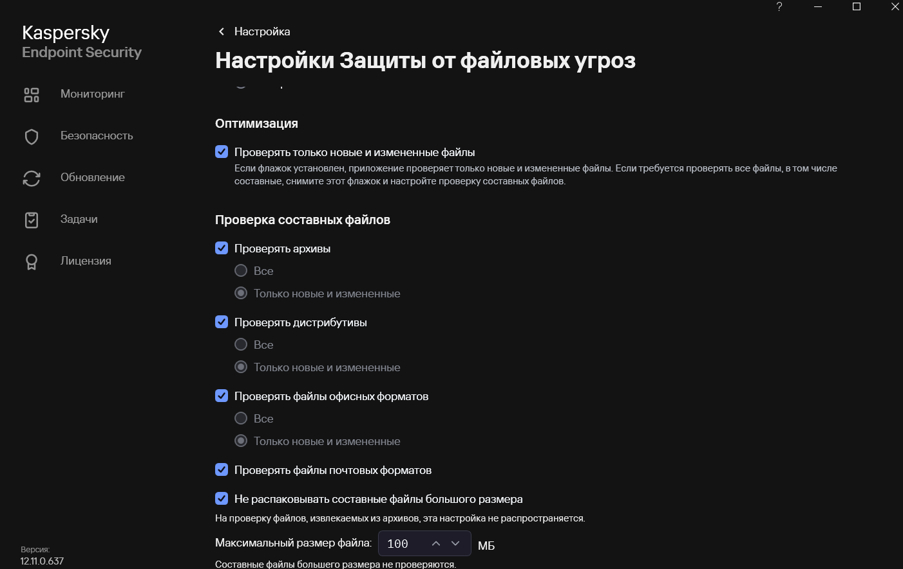
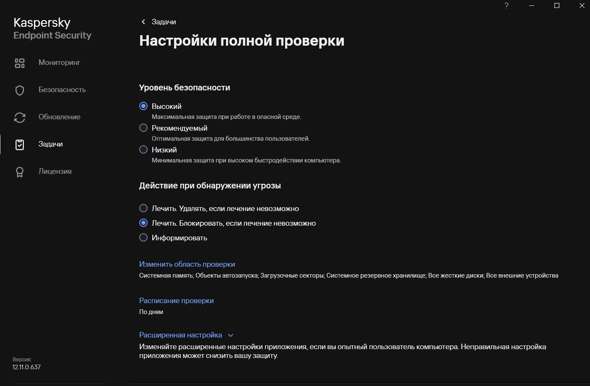
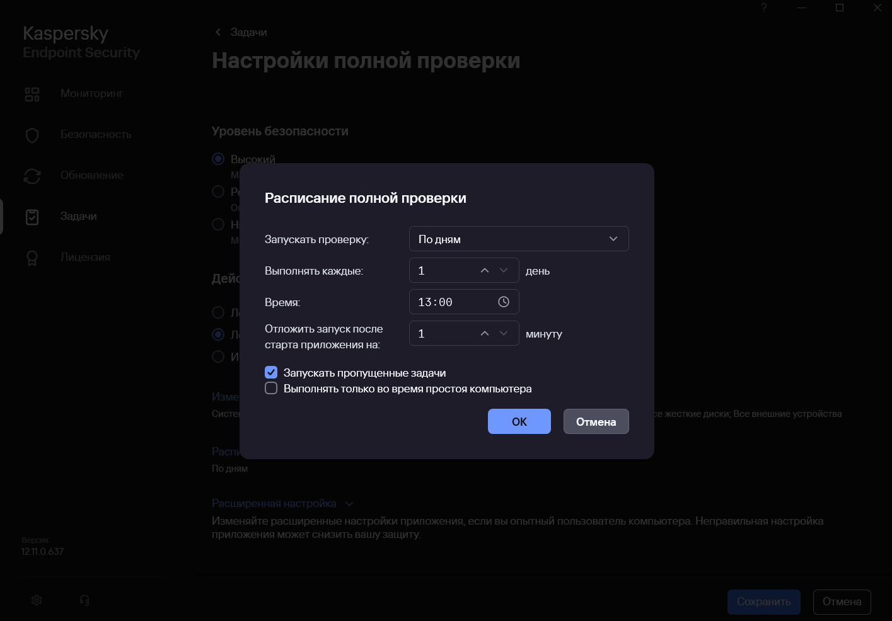
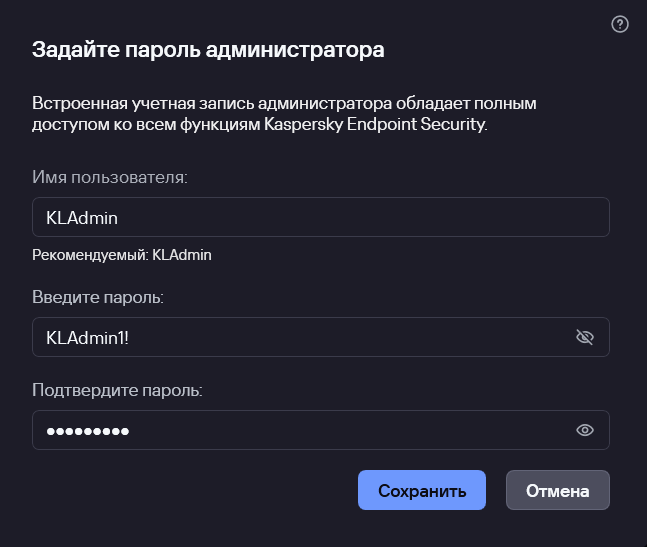
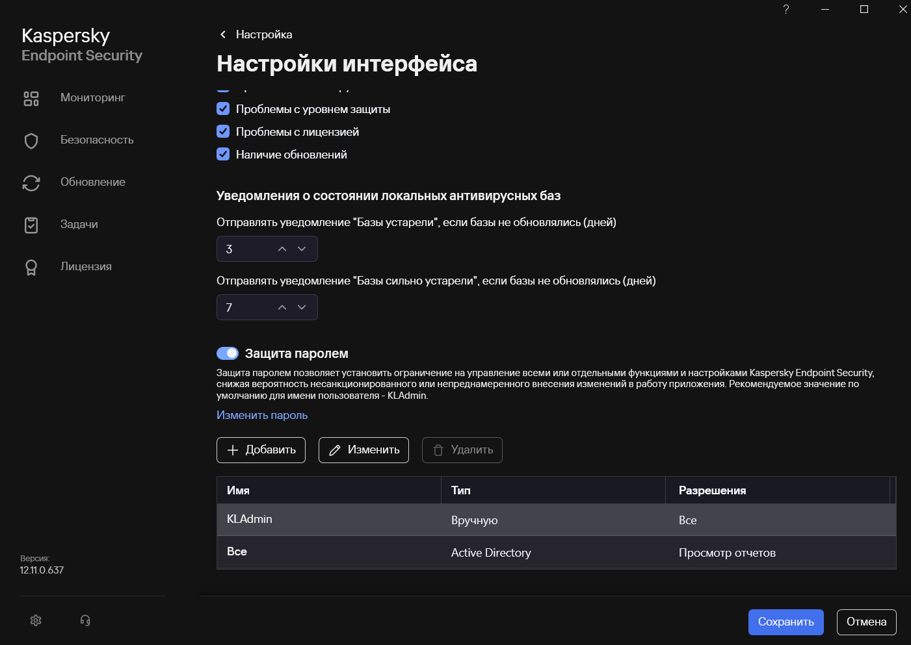
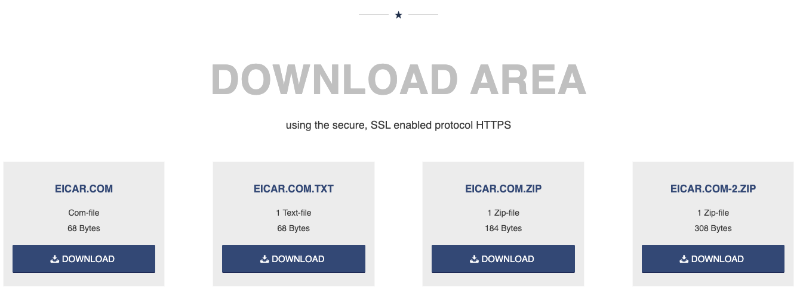
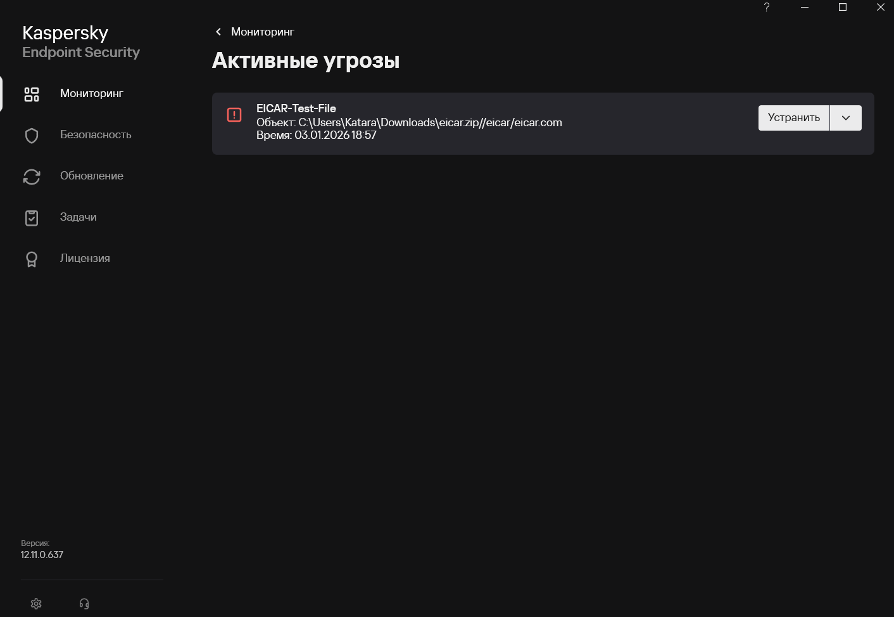

# «Средства антивирусной защиты»

---

## Kaspersky Endpoint Security

### Описание задания
  
 1.Скачать и установить Kaspersky Endpoint Security.  
 2.Настроить реакцию САВЗ на обнаруженные вредоносные программы.  
 3.Установить пароль на доступ к настройкам.  
 4.Проверить работоспособность САВЗ с использованием тестового вируса.  
  
### Результаты выполнения  
  
#### Скачена программа Kaspersky Endpoint Security:  
  

  
  
#### Далее будет проведена настройка реакции программы на обнаруженные вредоносные программы.  
  
- Настройка защиты от файловых угроз:  

  
  
- Настройка полной проверки системы:

  
  
- Настройка периодичности полной проверки системы:

  
  
- Установка пароля на доступ к настройкам:

  
  
- Проверка функционирования Kaspersky Endpoint Security.  
  
Проверка будет осуществленна с помощью тестовой вредоносной программы EICAR.  
  
Первый вариант проверки - создать текстовый файл и поместить туда содержимое COM-файла `X5O!P%@AP[4\PZX54(P^)7CC)7}$EICAR-STANDARD-ANTIVIRUS-TEST-FILE!$H+H*`.  
  
На рабочем столе системы был создан файл "Тестовый документ".txt с содержимым COM-файла. При попытке открыть текстовый файл Kaspersky Endpoint Security сразу же реагирует:

  
  

Второй вариант проверки - скачать сам файл EICAR с официального [сайта](https://www.eicar.org/download-anti-malware-testfile/):

  
  
После загрузки файла Kaspersky Endpoint Security сразу реагирует:

