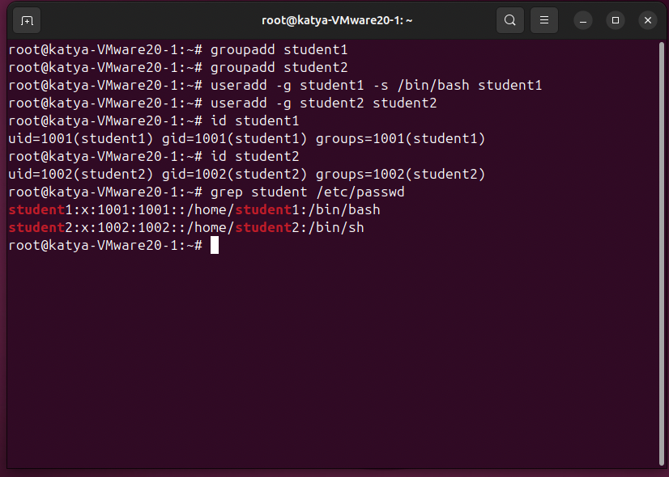
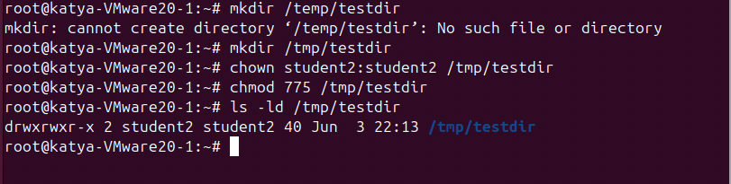
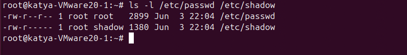

# «Linux Hardening»

---
  
### Задание 1
  
Создайте пользователя student1 с оболочкой bash, входящего в группу student1.  
Создайте пользователя student2, входящего в группу student2.  
  
Решение:  
  
  
  
  
### Задание 2  
  
Создайте в общем каталоге, например, /tmp, директорию.  
Назначьте для неё полный доступ со стороны группы student2 и доступ на чтение всем остальным.  
  
Решение:  
  
  
  
### Задание 3  
  
Определите, какой режим доступа установлен для файлов /etc/passwd и /etc/shadow.  
Объясните, зачем понадобилось именно два файла.  
  
Решение:  
  
  
  
Два файла необходимы для безопасности, один используют для общедоступной информации,  
второй для защиты данных о паролях и тд.  
  
Файл /etc/passwd хранит общедоступную информацию о пользователях: имя, UID, GID, домашнюю папку и оболочку.  
Файл /etc/shadow хранит хэши паролей и параметры их действия. Он закрыт от обычных пользователей.  
