# «Penetration Testing»

---
  
### Задание 1  
  
Используйте инструменты OSINT и найдите информацию о любом сервисе, которым пользуйтесь каждый день.  
  
### Результаты выполнения  
  
В качестве сервиса был выбран сервис Google, которым пользуюсь ежедневно.  
В ходе сбора информации о выбранном сервисе были использованы открытые источники:  
 - официальный сайт Google;  
 - страницы Google Data Centers;  
 - справочные материалы Google Workspace;  
 - Google Careers;  
 - Google Cloud.  
  
 - Найдена информация о расположении дата-центров,  
Google публикует эту информацию на своем [сайте](https://datacenters.google/locations/):  
  
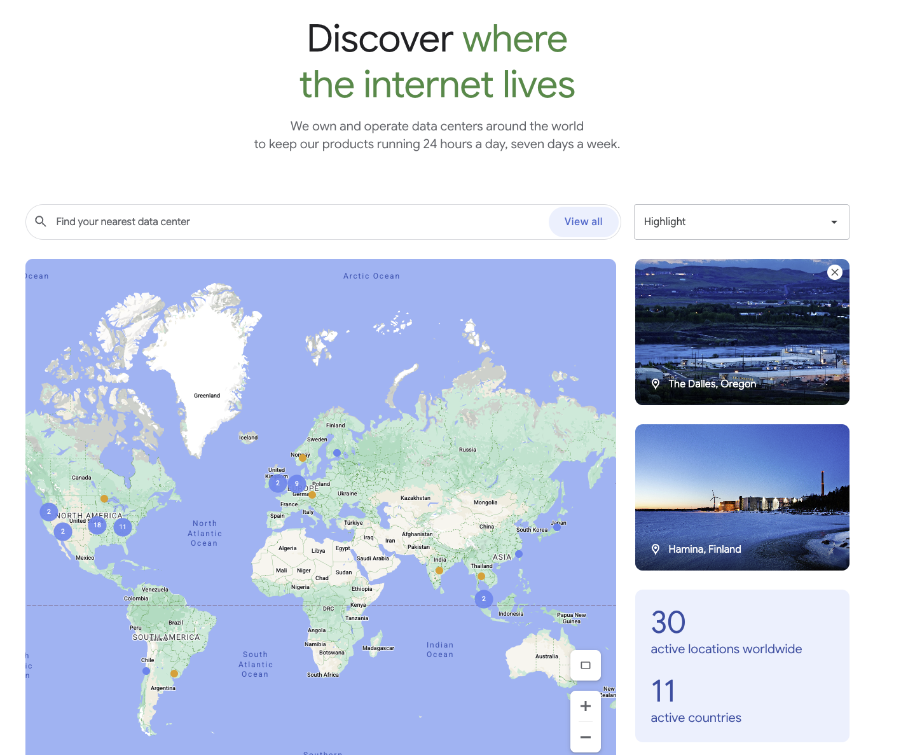  
  
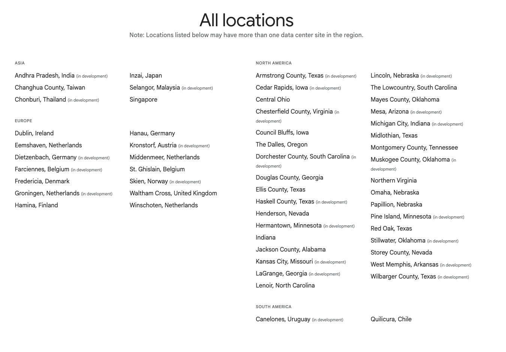  
  
 - Почтовая инфраструктура домена `gmail.com` проверялась через МХ записи:  
   
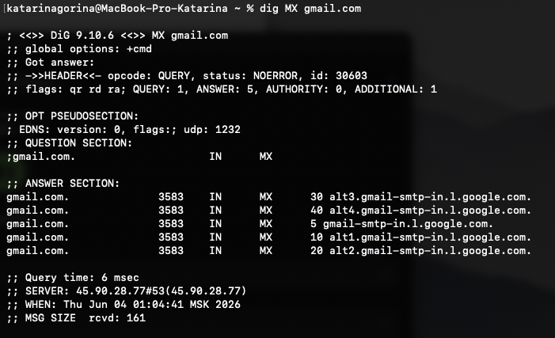  
  
В результате были найдены почтовые серверы Google:
 - `gmail-smtp-in.l.google.com`;  
 - `alt1.gmail-smtp-in.l.google.com`;  
 - `alt2.gmail-smtp-in.l.google.com`;  
 - `alt3.gmail-smtp-in.l.google.com`;  
 - `alt4.gmail-smtp-in.l.google.com`.  
  
  
 - Так же, на [сайте](https://about.google/company-info/locations/) Google есть информация о расположении офисов компании:  
  
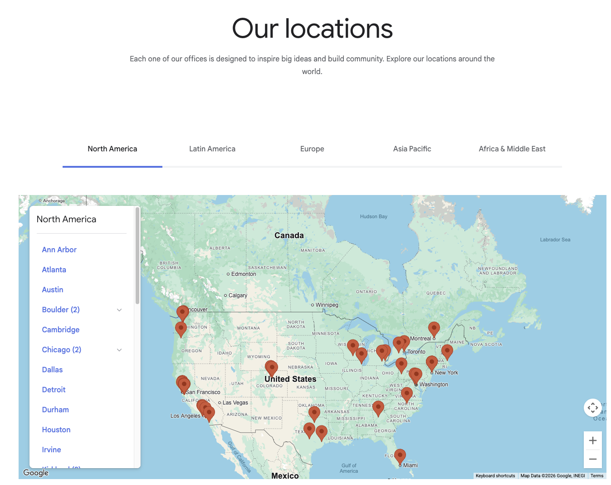  
  

 - На [Google Careers](https://www.google.com/about/careers/applications/) можно найти открытые вакансии и нарпавления работы компании.  
Вакансии могут косвенно показывать, что за технологии использует Google и какие специалисты сейчас требуются.
  
  
  
 - Google [публикует](https://cloud.google.com/about/locations?gclsrc=aw.ds&gad_source=1&gad_campaignid=23582223020&gclid=Cj0KCQjwof_QBhCgARIsADaMzOdbBEyV0Mi71OUG3gjXfqA3Wt6fBeza68G4_67R-dYoQgEO5_A2l5EaApfSEALw_wcB) информацию о своей облачной инфраструктуре Google Cloud - регионы т зоны, где есть облачные сервисы:  
  
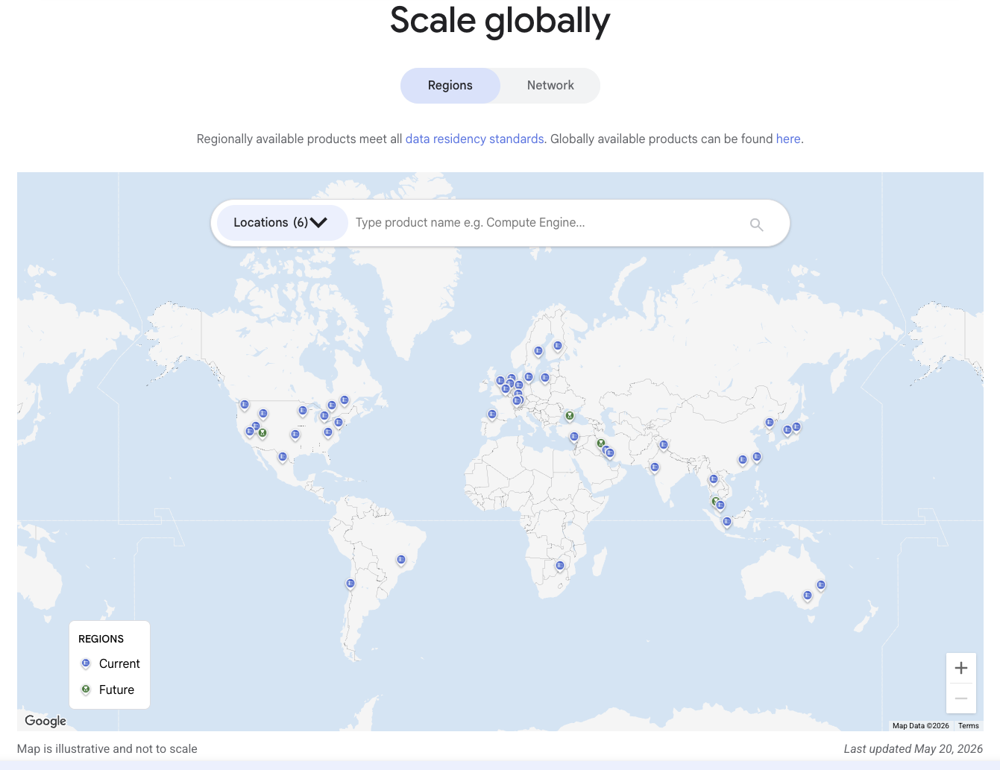  
  
  
 - Эта информация может быть полезна на этапе первичной разведки:  
  
 -данные о дата-центрах помогают понять географию инфраструктуры;  
 -MX-записи показывают публичную почтовую инфраструктуру домена;  
 -информация об офисах показывает географию присутствия компании;  
 -вакансии могут подсказать, какие технологии и специалисты используются в компании;  
 -информация о Google Cloud помогает понять расположение облачной инфраструктуры.  
  
### Задание 2  
  
 - Проведите первичный пентест уязвимого приложения Google Gruyere с помощью OWASP ZAP или Burp Suite.
 - Найдите в приложениях XSS, XSRF, XSSI, Path Traversal и Code Execution. Какая-то часть уязвимостей может быть найдена автоматически, другая часть найдётся только вручную.

### Результаты выполнения  
  
 - После регистрации на Google Gruyere, получила свой экземпляр приложения:  
  
`https://google-gruyere.appspot.com/341493511768280369906586122655524334205/`
  
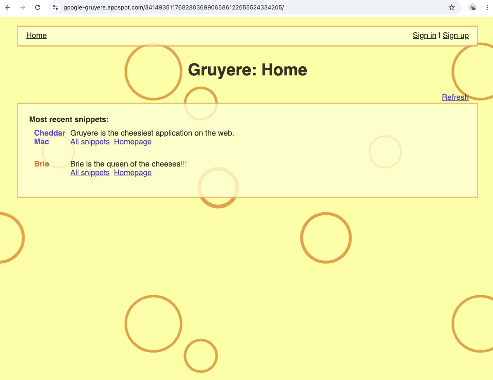  
  

 - Проверка на XSS через форму создания нового сниппета:  
  
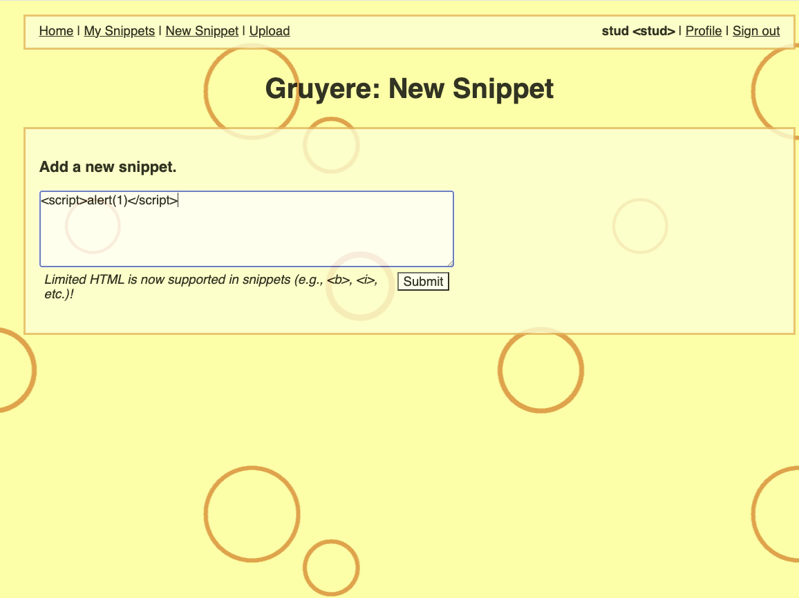  
  
Plaload `` не выполнился, далее был использован ``,  
после чего появилось всплывающее окно `alert(1)` - наличие XSS зафиксировано.  
  
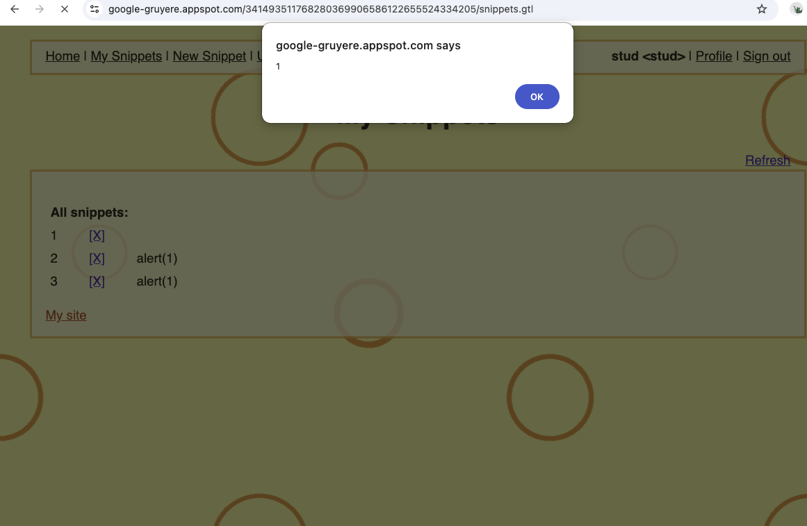  
  

 - Проверка на Path Traversal через загруженный файл `test.txt` с содержимым текстом "Path traversal testing":  
  
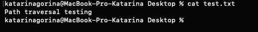  
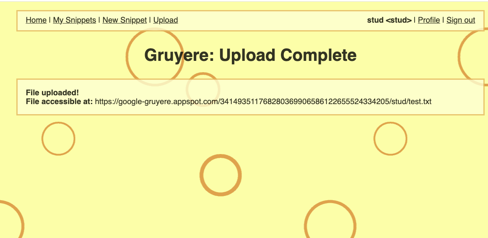  
  

 - Для проверки изменила путь к загруженному файлу на  
`https://google-gruyere.appspot.com/341493511768280369906586122655524334205/..%2fsecret.txt`.  
  
В результате открылось содержимое другого файла:  
  
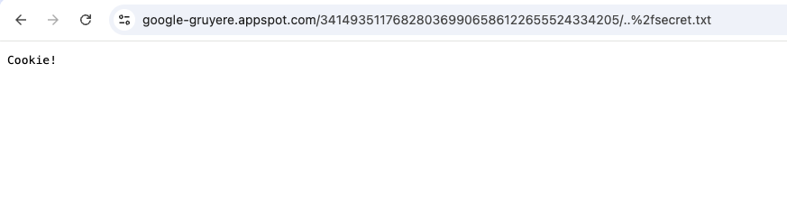  
  
Что подтверждает наличие Path Traversal - возможность доступа к чужим файлам через изменение пути.  
  
 - Проверка на XSRF была сделана с помощью ссылки удаления сниппета `[X]`.  
  
То есть, удаление происходит через GET-запрос:  
 `https://google-gruyere.appspot.com/341493511768280369906586122655524334205/deletesnippet?index=0`.  
  
Подобный запрос не имеет защитного CSRF-токена при этом меняет состояние приложения, то есть при открытии такой страницы сниппет удаляется без подтверждения пользователя, что подтверждает наличие уязвимости XSRF.  
  
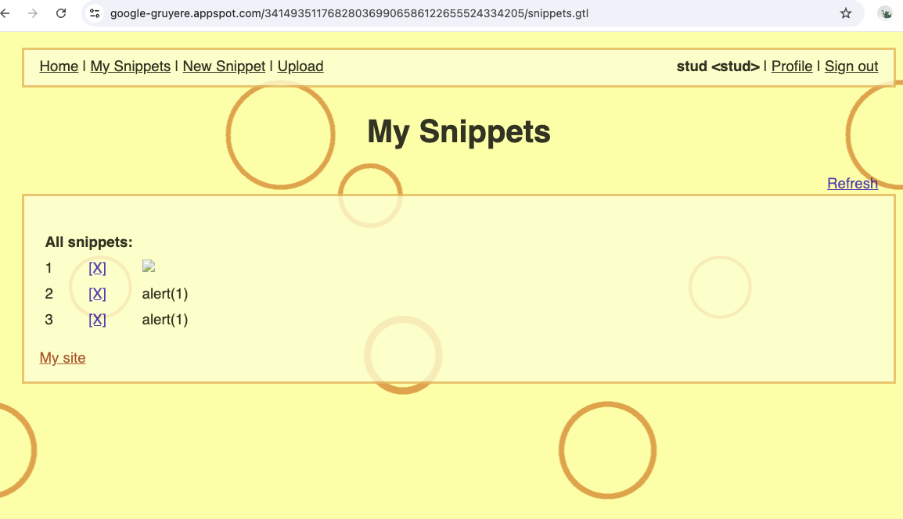  
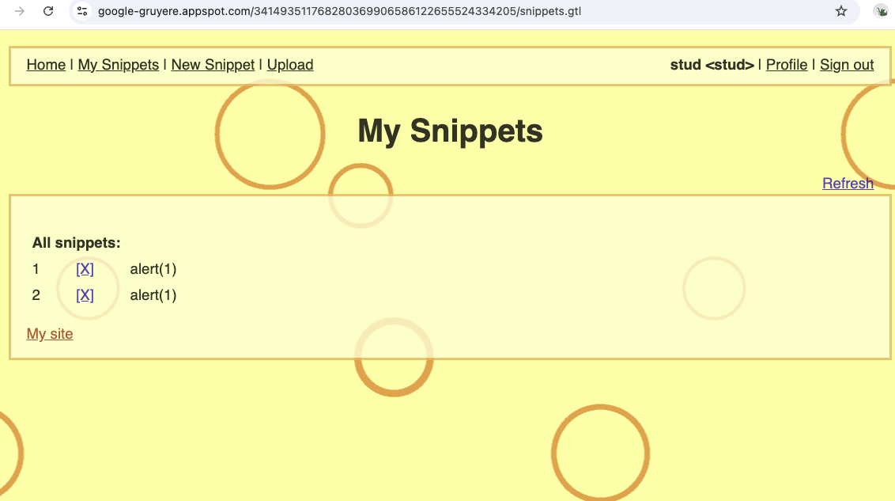  
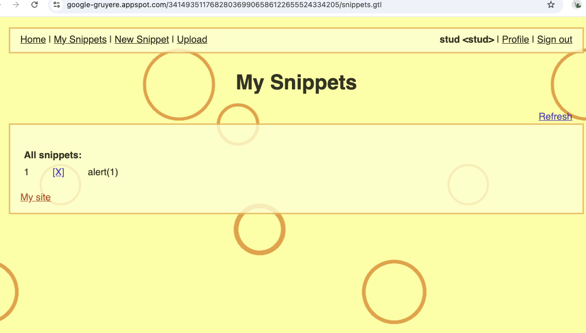  
  
 - Для проверки на XSSI, проверяем endpoint.  
  
Открываю в браузере:  
  
`https://google-gruyere.appspot.com/341493511768280369906586122655524334205/feed.gtl`.  
  
В ответе приложение возвращает данные некоего пользователя, что подтверждает налиие XSSI-уязвимости:
  
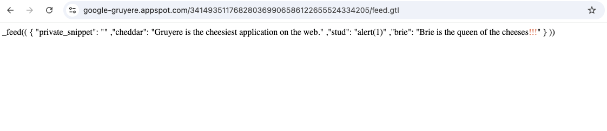  
  
 -  - Проверку на Code Execution сделала посредством изменения серверного файла gtl.py и выгрузки его в Gruyere под пользователем `..`.    
  
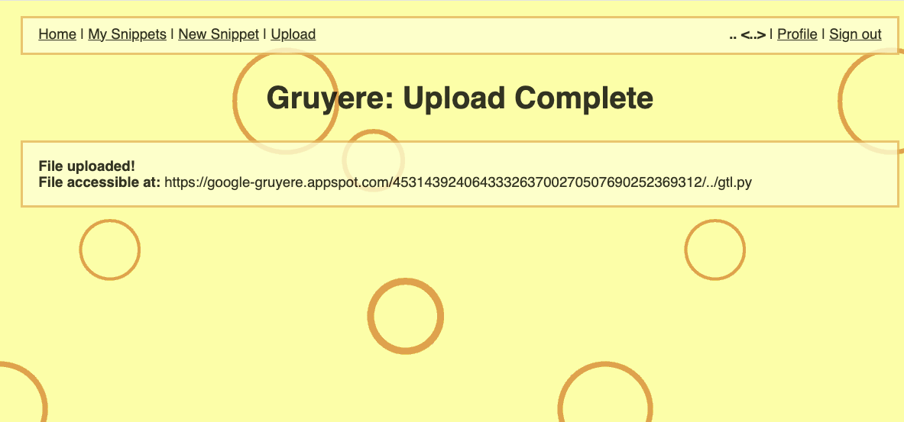  
  
 - Далее перезапустила сервер через `quitserver`. После перезапуска сервера  
приложение выдало сообщение:  
  
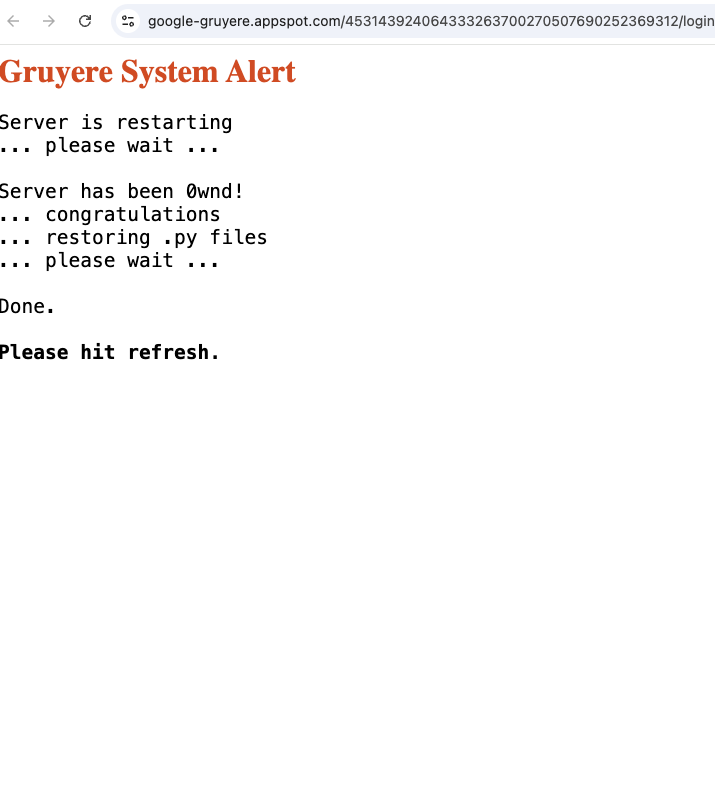  
  
Сообщение `Server has been 0wnd!` фактически доказывает наличие уязвимости -  
серверный файл был подменен, приложение считало это и восстановило файл, что нормально для учебного стенда.  
  
 - С помощью автоматического сканирования через ZAP, были найдены уязвимости:  
  
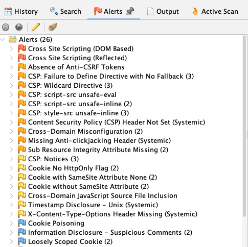.  
  
  Наиболее значимые уязвимости, найденные с помощью автоматического сканирования:  
  
- `Cross Site Scripting (DOM Based)` — XSS-уязвимость, при которой JavaScript выполняется на стороне браузера из-за небезопасной обработки данных в DOM. Вредоносный код может выполниться без изменения ответа сервера.

- `Cross Site Scripting (Reflected)` — XSS-уязвимость, при которой вредоносный код передаётся в запросе и сразу возвращается в ответе страницы. Если пользователь откроет специально сформированную ссылку, код выполнится в его браузере.

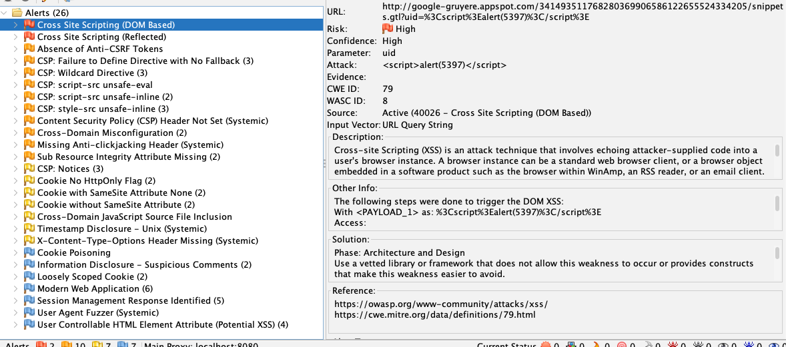  
  
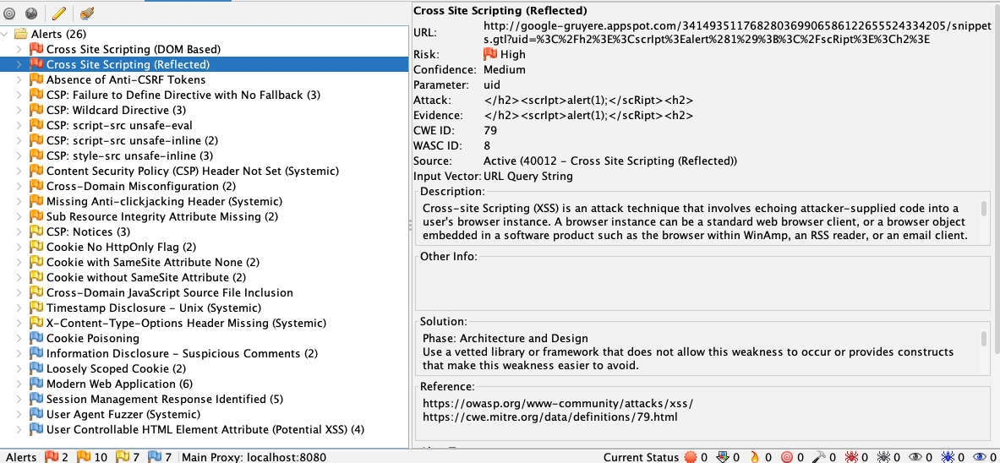  

