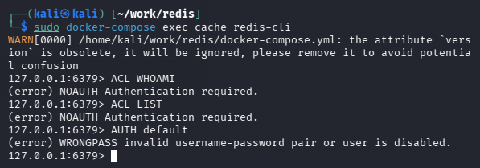
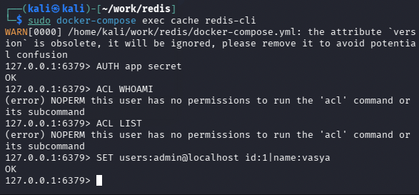
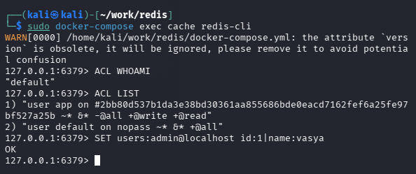

# Домашнее задание к занятию «2.2. Системы хранения данных: кеши, очереди, файловая система»

---

## Задание «Redis ACL»

### Описание задания

Разбор нового механизм ACL, появившийся в Redis 6.0.  
В качестве целевой конфигурации будет использоваться файл [docker-compose.yml](./screens/docker-compose.yml).  
Так же будет использоваться файл конфигурации [redis.conf](./screens/redis.conf).  

### Результаты выполнения

#### Часть 1.  
Были запущены терминалы в развернутой виртуальной машине Kali. 
Скачены файлы в рабочую папку: `docker-compose.yml` и `redis.conf`.  

#### Часть 2. 
Отредактирован файл `redis.conf` - добавлена запись `user default off` на 759 строку, запущен контейнер Redis в одном из терминалов 
командой `docker-compose up`.  
Выполнены необходимые команды - `ACL WHOAMI`, `ACL LIST`, `AUTH default`.

Завершена работа контейнера `Ctrl + C`, а так же данные контейнера удалены `docker-compose rm`.  

#### Часть 3.  
Отредактирован файл `redis.conf` - на 760 строку добавлена запись:
`user app on #2bb80d537b1da3e38bd30361aa855686bde0eacd7162fef6a25fe97bf527a25b ~* +@read +@write`.  
Расшифрован пароль хэша `2bb80d537b1da3e38bd30361aa855686bde0eacd7162fef6a25fe97bf527a25b` - secret.  
Выполнены необходимые команды

#### Часть 4.  
Отредактирован файл `redis.conf` - на 759 строке удалена запись `user default off`.

