# Домашнее задание к занятию «СЗИ от несанкционированного доступа»

---

## Задание Secret Net Studio  

### Описание задания  

1. Скачать и установить Secret Net Studio.  
2. Настроить параметры входа в систему, чтобы защититься от подбора паролей пользователей.  
3. Настроить полномочное управление доступом, чтобы ограничить доступ недопущенных пользователей к конфиденциальным документам.  
4. Настроить контроль устройств, чтобы исключить утечку конфиденциальной информации с использованием съёмных носителей и технологий беспроводного доступа.  

### Результаты выполнения  

- Настройка параметров входа в систему:

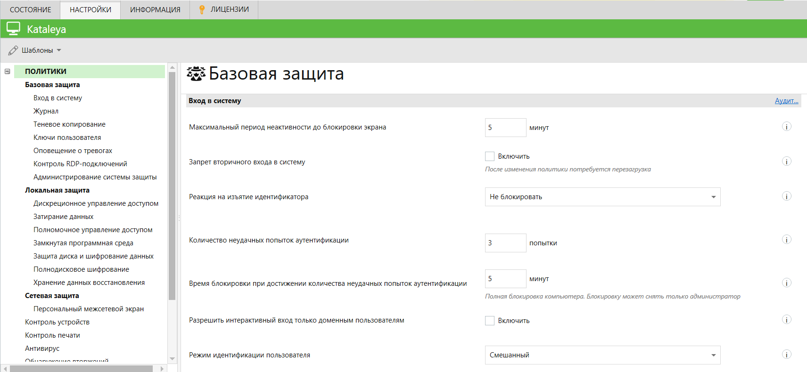

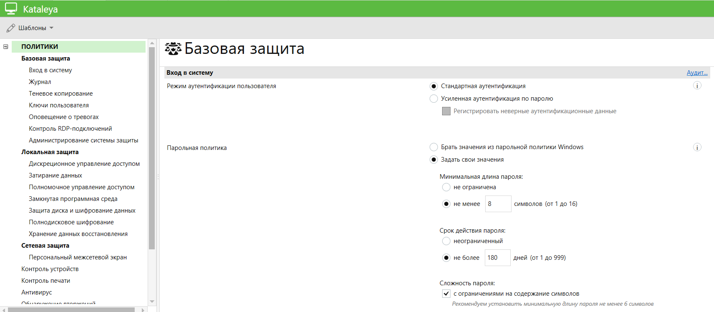

- Настройка полномочного управления сервисом.  
Заданы уровни конфиденциальности: "Общедоступно" и "Коммерческая тайна":

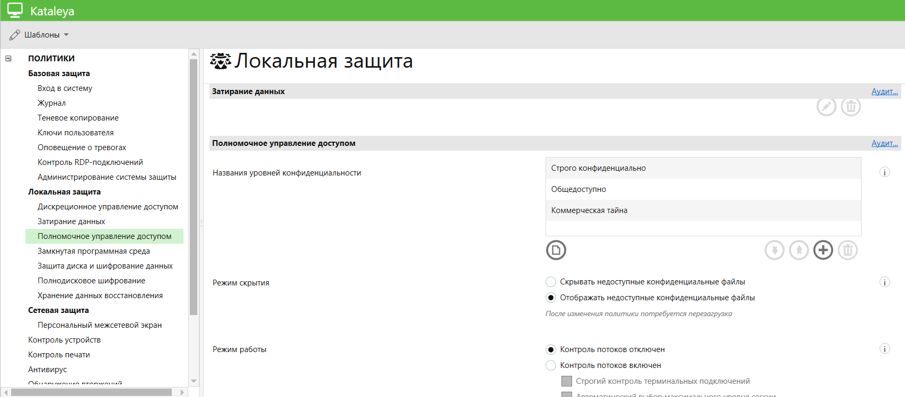

- Созданы два пользователя - `petrov` и `ivanov`.  
Для пользователя `ivanov` задан уровень конфиденциальности "Общедоступно".  
Для пользователя `petrov` задан уровень конфиденциальности "Коммерческая тайна", а так же отмечены пункты "Печать конфиденциальных документов" и  "Вывод конфиденциальной информации".

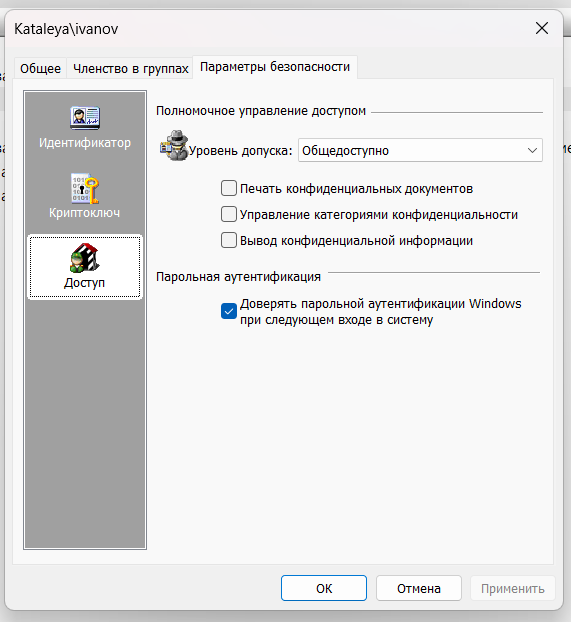

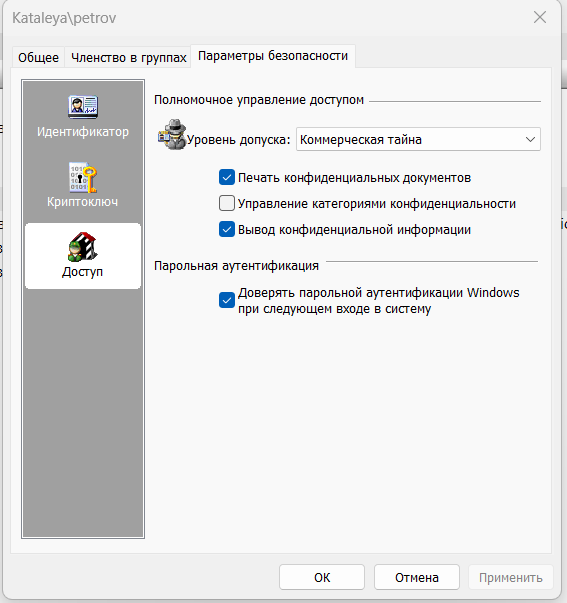

- Создана папка "КТ_" с помещенным в нее документом "Коммерческая тайна", папке присвоен уровень конфиденциальности "Коммерческая тайна":

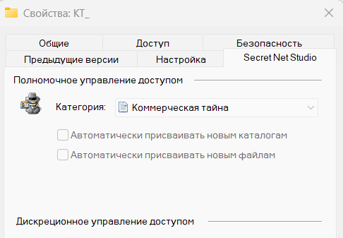

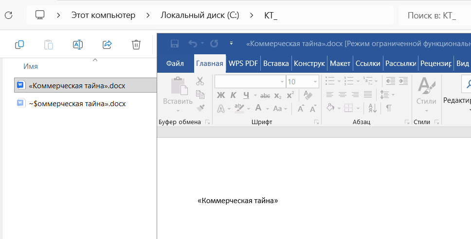

- Далее применены настройки управления доступом, в результате пользователь `ivanov` не имеет прав доступа к папке "КТ_":

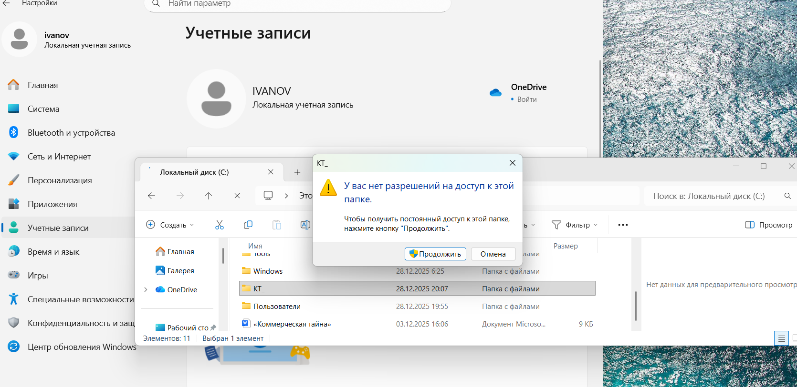

Небольшая ремарка - как видно из изображения, пользователь `ivanov` имеет ограничения на уровне каталога "КТ_", а не файла как требуетс$

Пользователь `petrov` же имеет доступ к папке и файлу:

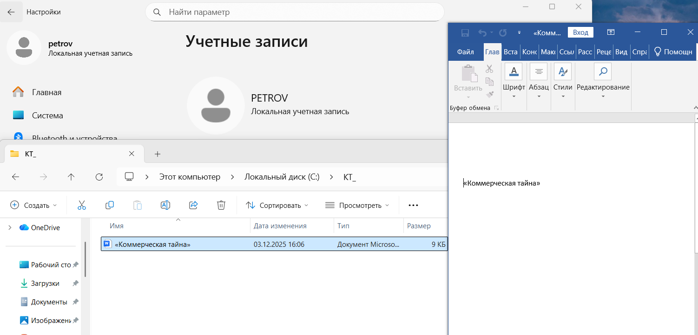

- Настройка контроля устройств.  
Настроен запрет на использование следующих устройств:  
 -Сменных дисков;  
 -Оптических дисков;  
 -Сетевых плат и модемов;  
 -Bluetooth-адаптеров;  
 -Сотовых телефонов (смартфонов, ПК);  
 -Устройств PCMCIA;  
 -Устройств IEE1394;  
 -Устройств Secure Digital.  

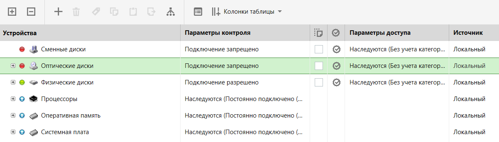

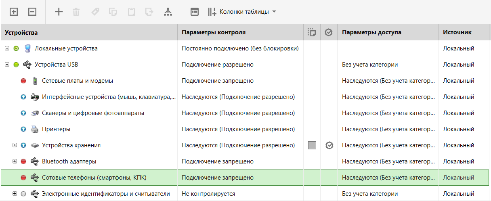

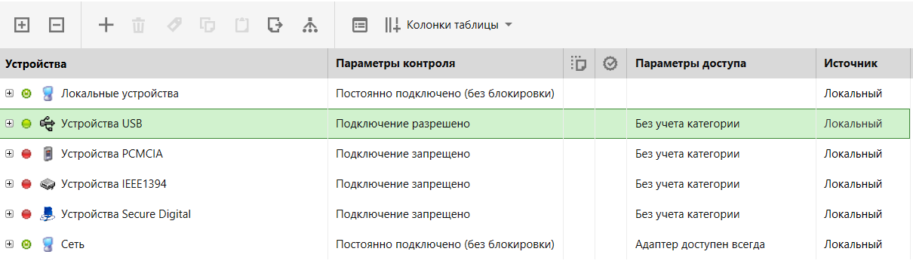  

- Для "Устройства хранения" запрещена запись для пользователя `petrov`:

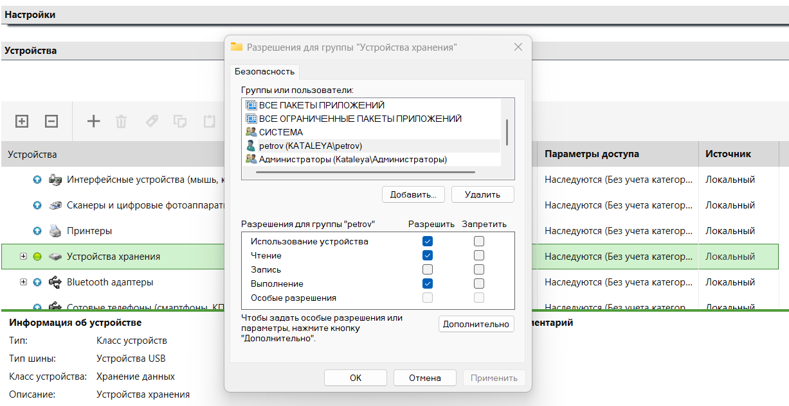

