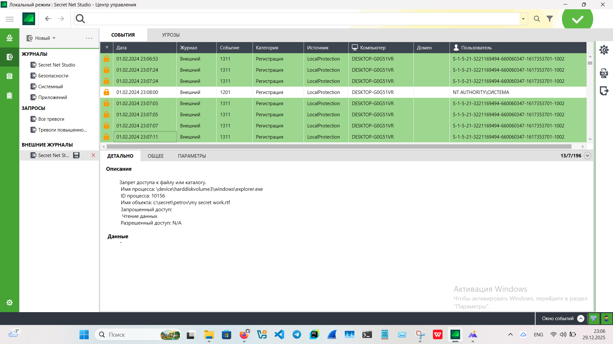
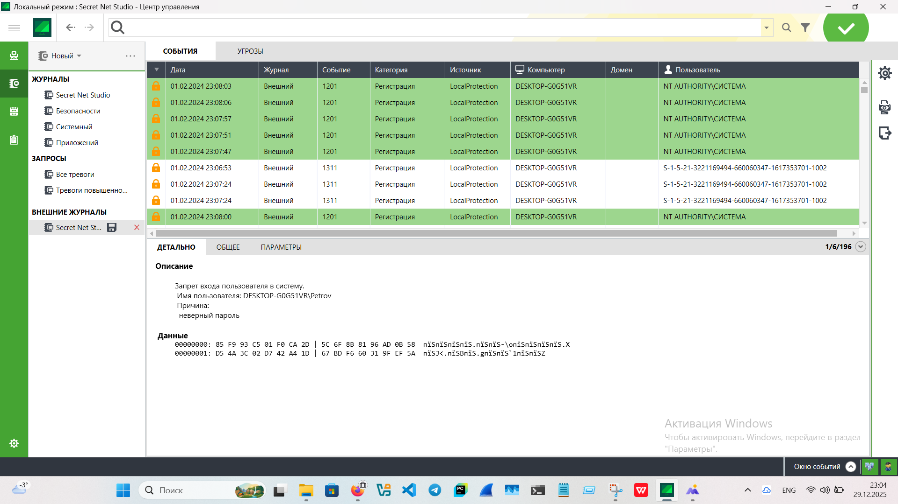
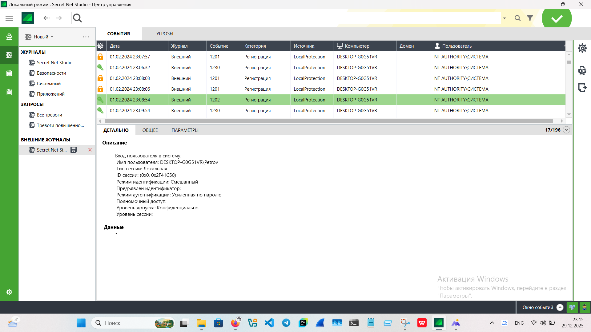
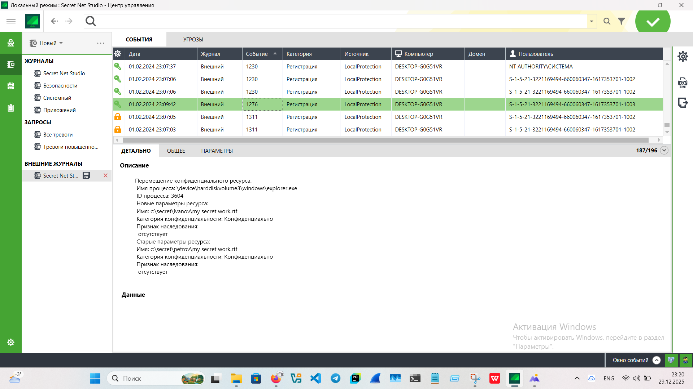
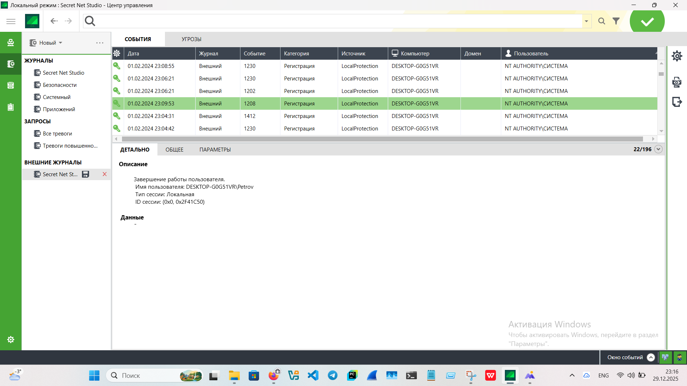
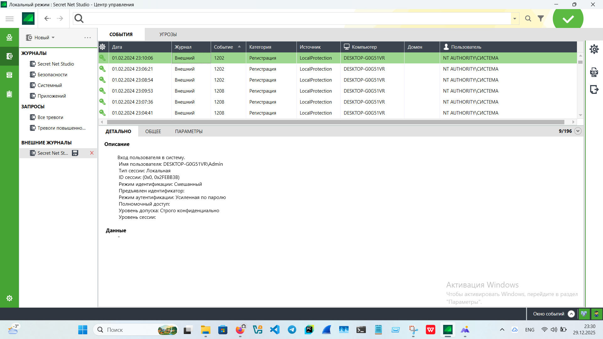
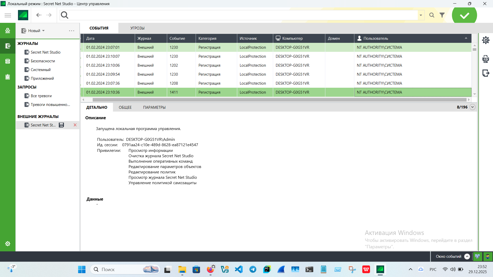
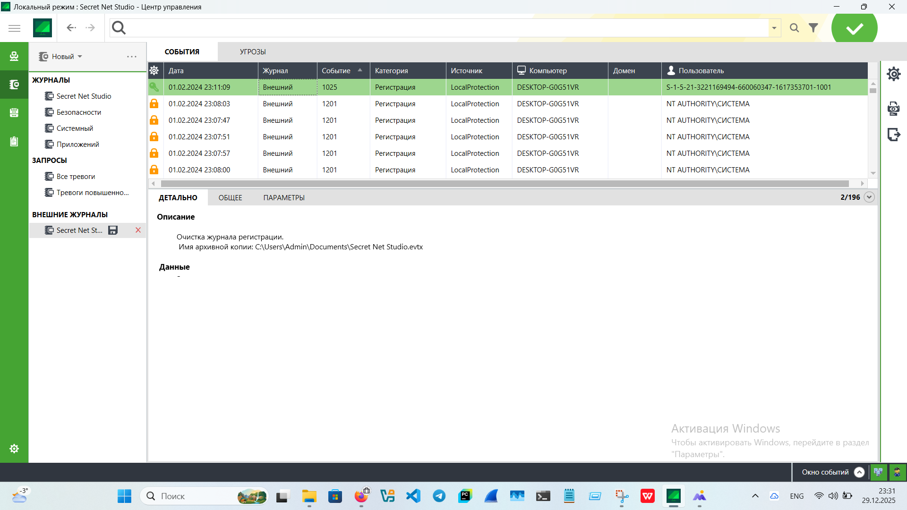
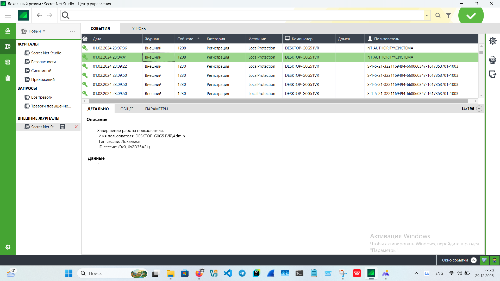

# «Security Information and Event Management (SIEM)»
  
---
  
## SIEM в Secret Net Studio  
  
SIEM позволяет расследовать компьютерные инциденты и восстанавливать картину инцидента. Эти приёмы часто используются 
в компьютерной криминалистике.  
    
### Описание задания  
  
Загрузить журнал [SIEM](./screens/SecretNetStudio.evtx).  
  
Проанализировать журнал на предмет инцидента - кражу конфиденциальной информации у сотрудника Петрова сотрудником Ивановым.  
Сотрудник Петров в день инфедента находился на больничном и физически на рабочем месте отсутствовал.  
  
### Результаты выполнения  
  
В ходе анализа журнала SIEM в Secret Net Studio были выявлены некоторые события, описанные ниже.  
  
Хронология событий:  
  
- Вход пользователя Иванова в систему, тип сессии - локальная, что подтверждает присутствие Иванова на рабочем месте  
в день инцедента:  
  
  

  
  
- Далее зафиксированы 7 попыток доступа к конфиденциальному файлу Петрова - `c:\secret\petrov\my secret work.rtf`:  
  
  

  
  
- После пользователь Иванов вышел из системы:  
  
  

  
  
- Зафиксировано 6 попыток авторизации под пользователем Петров, отказ в авторизации по причине  
неправильного пароля:  
  
  

  
  
- Вход пользователя Петрова в систему, тип сессии локальная:  
  
  

  
  
- После авторизации произошло копирование конфиденциального файла из `c:\secret\petrov\my secret work.rtf`  
в `c:\secret\ivanov\my secret work.rtf`. Далее пользователь Петров вышел из системы:  
  
  

  

  
  
- Запуск локальной программы управления Secret Net Studio от имени Admin:
  
  

  
  
- Очистка журнала регистрации и завершение работы пользователя Admin:
  
  

  
  
### Итоговый вывод  
  
На основании анализа журнала видно, что Иванов действительно присутствовал физически на рабочем месте - это  
подтверждает локальный тип сессии. Так же видно, что между входом и выходом Иванова из системы, он совершил  
7 безуспешных попыток скопировать конфиденциальный объект из директории пользователя Петрова.  
  
Далее воспользовавшись отсутствием Петрова, Иванов после несколькизх попыток, все же вспомнил пароль   
от его учетной записи, произвел вход, скопировал конфиденциальный файл и после зайдя от имени администратора  
очистил журнал регистрации. Тем самым Иванов попытался скрыть факт авторизаций от имени Петрова и факт копирования  
рационализаторского предложения.
