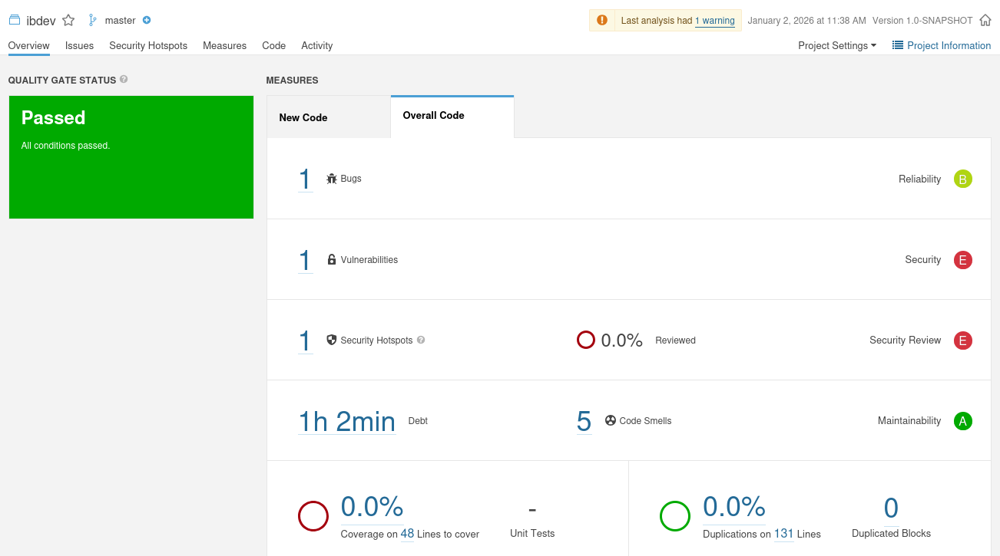
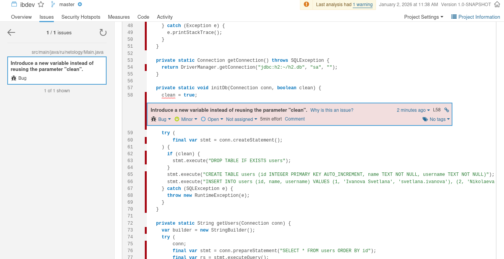
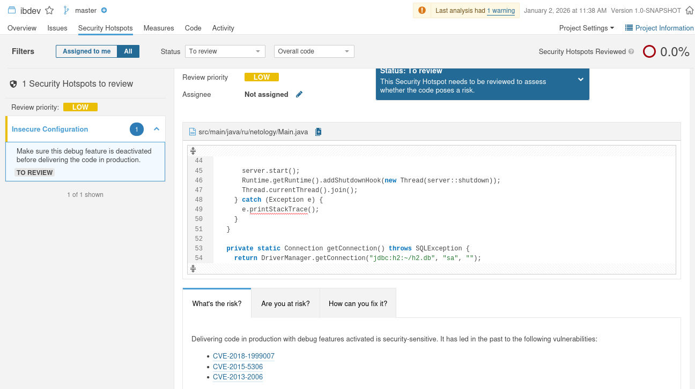
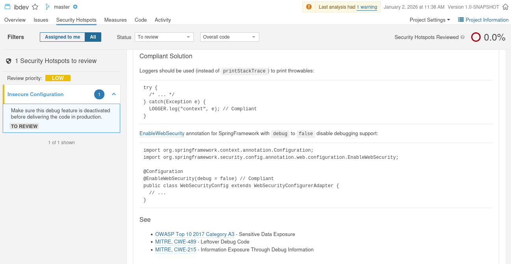
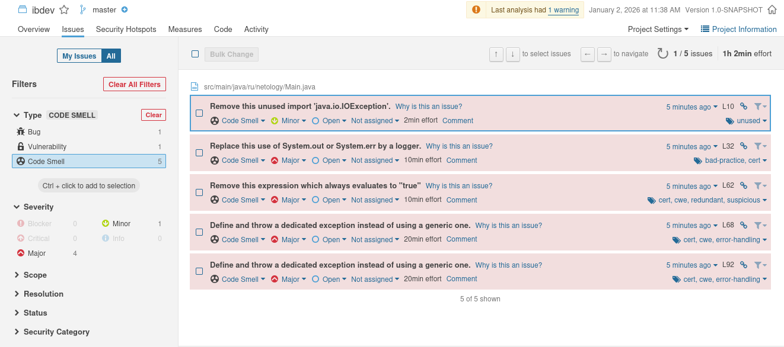

«Популярные языки, системы сборки, управления зависимостями

---

## Задание SonarQube

### Описане проекта 

Знакомство с инструментом [SonarQube](https://www.sonarsource.com/products/sonarqube/)

### Задачи:

1. Получить базовый опыт работы с инструментом.
2. Проанализировать предупреждения, баги и уязвимости.

### Результаты выполнения

- Запуск сервиса SonarQube:

- Выявлен 1 баг: `Introduce a new variable instead of reusing the parameter "clean"` - "Введите новую переменную 
вместо повторного использования параметра 'clean'".  
То есть эта переменная используется уже повторно и необходимо создать новую.

- Выявлена 1 уязвимость: `“Add password protection to this database”.`  
Означает, что пароль отсутствует и доступ к базе неавторизированный. 
Подобная уязвимость может привести к утечке и изменению данных.

- Выявлен один Security Hotspot - Insecure Configuration, с LOW приоритетом.  
Необходимо отключить функцию отладки кода, так как это привело к следующим уязвимостям в прошлом:  
 `CVE-2018-1999007` - утечка чувствительной информации через stack trace(содержит пути к файлам, SQLзапросы и т.д.);    
 `CVE-2015-5306` - в режиме отладки позволяет злоумышленникам получить доступ к панели Flask и выполнить 
код на Питоне тем самым вызвав ошибку;  
 `CVE-2013-2006` - в режиме отладки, записывает admin_token и пароль LDAP в открытом виде, что позволяет локальным пользователям 
получить доступ к конфиденциальной информации, прочитав файл лога.  

- Отсылка для Security Hotspots идет к следующим CWE (Common Weakness Enumeration):  
  `OWASP Top 10 2017 Category A3` - Утечка конфиденциальных данных;  
  `MITRE, CWE-489` - Активный отладочный код;  
  `MITRE, CWE-215` - Внедрение конфиденциальной информации в отладочный код.

- Выявлено 5 `Code Smells`:

 1. `Remove this unused import 'java.io.IOException'` - неиспользуемый импорт (части кода) необходимо удалить, так как 
код становится плохо читаемым.
 2. `Replace this use of System.out or System.err by a logger` - необходимо использовать логгер вместо стандартного потока вывода.
 3. `Remove this expression which always evaluates to "true"` - не использовать логику, которая всегда возвращает `true`.
 4. `Define and throw a dedicated exception instead of using a generic one` - необходимо использовать специальное исключение 
а не обобщенный метод.
 5. `Remove this unused import 'java.io.IOException'` - то же что и в первом случае, но в другом месте.

  
- SonarQube считает вышеперечисленное именно запахами кода, потому что они ничего не ломают в данный момент, но есть риск в будущем,
а так же на данный момент дают ухудшенную читаемость.
