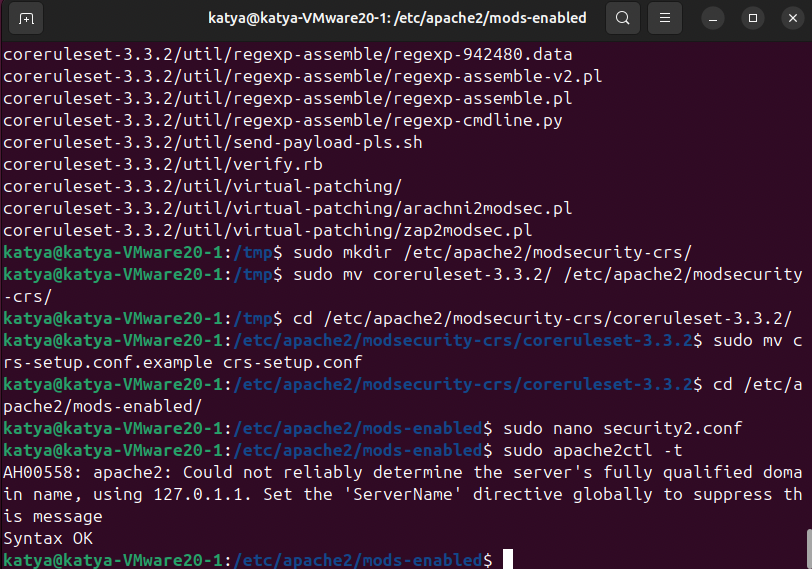
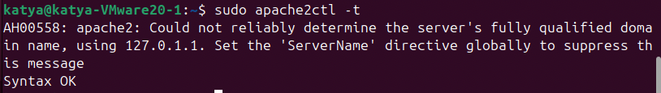
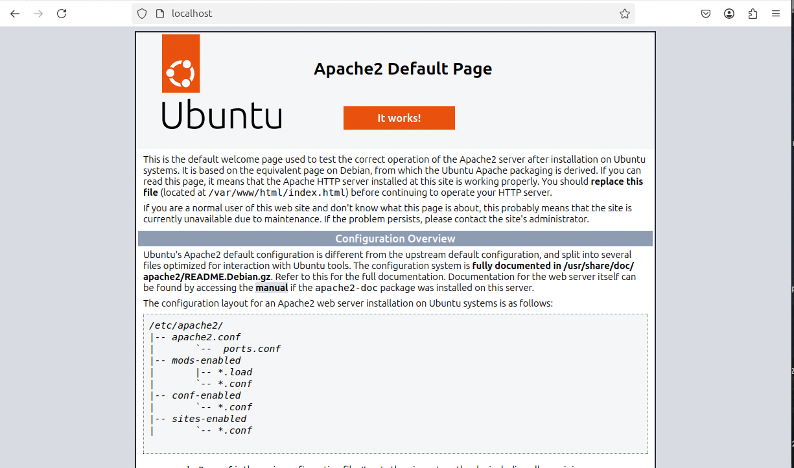
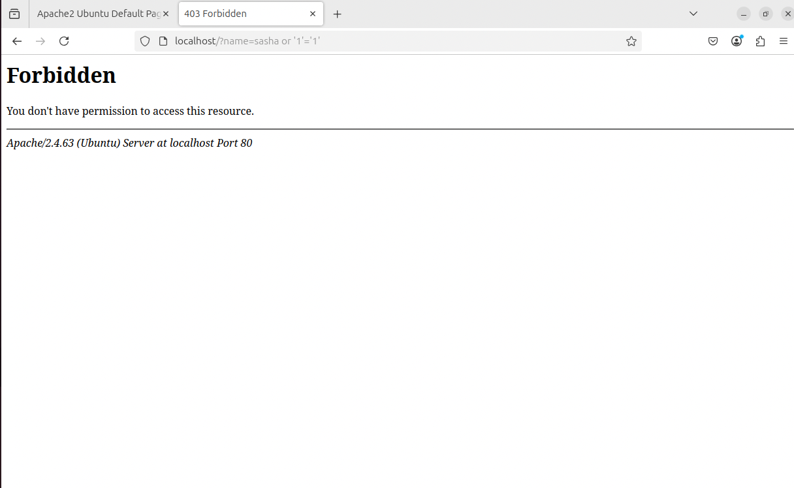

# «Web Application Firewall (WAF)»

---
  
## ModeSecurity  
  
ModSecurity — это бесплатный межсетевой экран веб-приложений (WAF) с открытым исходным кодом.  
Он защищает от различных веб-атак - SQL-инъекций, XSS и утечки данных, анализируя HTTP-трафик и блокируя подозрительные запросы и ответы.  
    
### Описание задания
  
 1. Установить WAF OWASP `ModeSecurity`.  
 2. Установить базовый набор правил для обнаружения сетевых атак.  
  
### Результаты выполнения  
    
Задание будет выполняться в развернутой виртуальной машине ОС Ubuntu:
  
- После обновления пакетов, устанавливлены веб-сервер `Apache`, пакет `wget` и `ModeSecurity`.  
Произведены шаги по настройке WAF OWASP ModeSecurity:

    
  
- Тест конфигураций веб-сервера sudo apache2ctl -t произведен успешно:  

  
  
- Тестирование работы веб-сервера `http://localhost`:

  
  
- WAF блокирует симетированную SQL-инъекцию `http://localhost/?name=sasha or '1'='1'` с кодом `403`:

  
