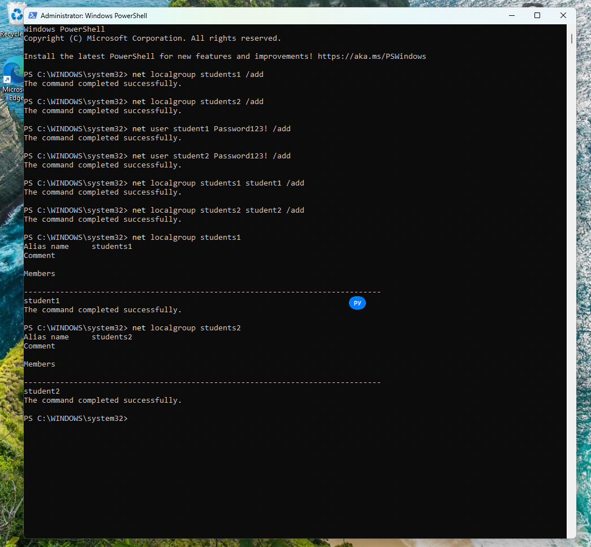
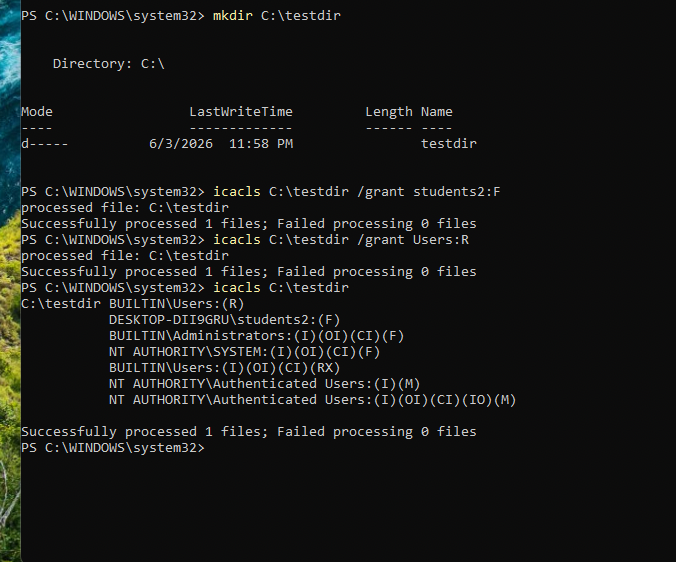
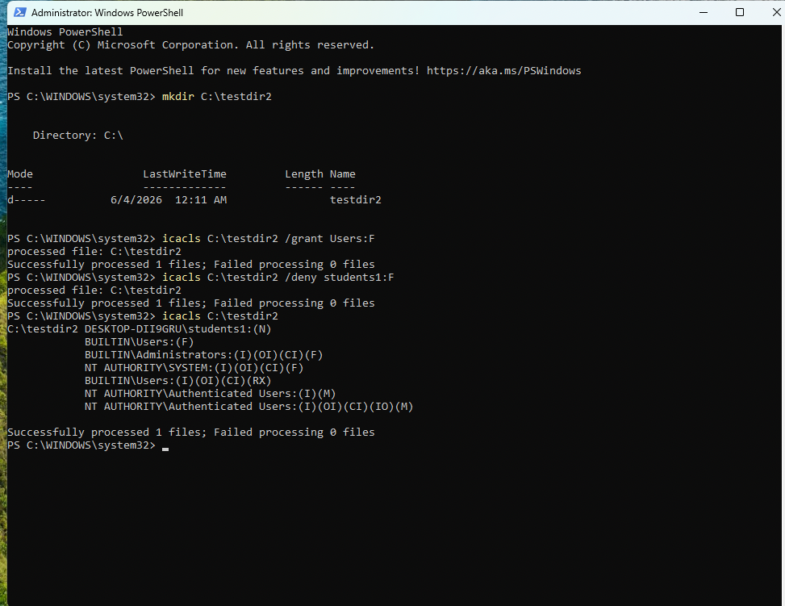

# «Windows Hardening»

---
  
### Задание 1  
  
Создайте пользователя student1, входящего в группу students1.  
Создайте пользователя student2, входящего в группу students2.  
  
Решение:  
  
  
  
  
### Задание 2  
  
Создайте в общем каталоге папку.  
Назначьте для неё полный доступ со стороны students2 и доступ на чтение остальным пользователям.  
  
  
Решение:  
  
  
  
### Задание 3  
  
Создайте в общем каталоге папку и назначьте для неё полный доступ для всех, кроме группы students1.  
Группа students1 не должна иметь доступа к содержимому этого каталога.  
  
Решение:  
  
  
