# Домашнее задание к занятию «1.1. Контейнеризация (Docker)»

---

## Задание 1. Образы и контейнеры Docker

### Описание задания

Необходимо установить базовые компоненты Docker. Выполните загрузку готового образа из общедоступного репозитория, 
запустите контейнер на основе загруженного образа, реализуйсте базовые операции с контейнерами и образами.

### Результат выполненного задания

- Скриншот вывода команды `ifconfig` (Kali Linux):

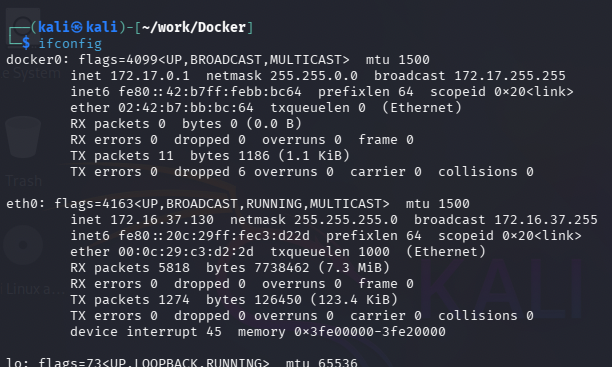

- скриншот вывода результатов команды `sudo docker pull bash`:

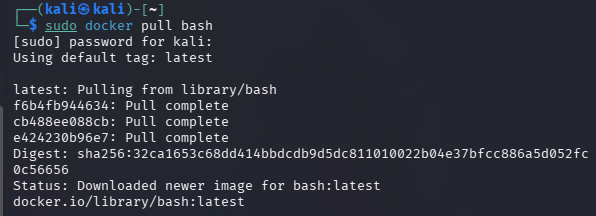

- скриншот вывода результатов команды `sudo docker run -it bash`:

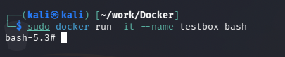

- скриншот вывода результатов команд:

 - `sudo docker stop testbox`

 - `sudo docker rm testbox`

 - `sudo docker rmi bash`

 - `sudo docker ps -a`

 - `sudo docker image ls`:

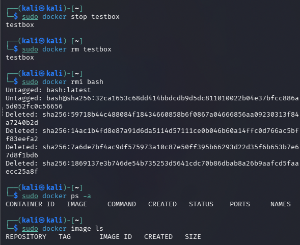

---

## Задание 2. Bash в Docker

### Описание задания

Необходимо выполнить работу с контейнером Docker в интерактивном режиме и предоставить объективные доказательства 
присутствия в контейнере.

### Результат выполненного задания

- Скриншот вывода результатов команды `sudo docker run --rm -it bash`:

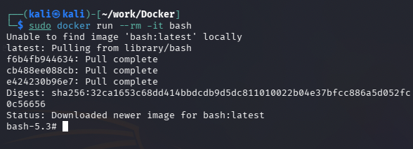

- скриншот вывода результатов команд `whoami`, `cat /etc/*release*` и `ls -la /` (в контейнере):

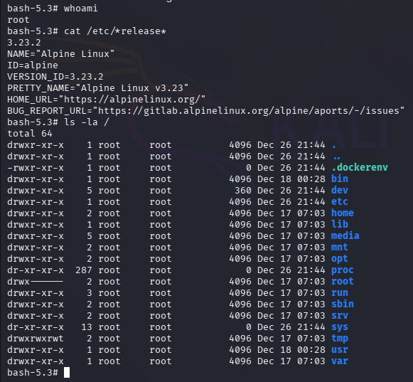

- скриншот вывода результатов команд `whoami` и `cat /etc/*release*` (в основной системе):

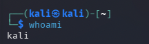

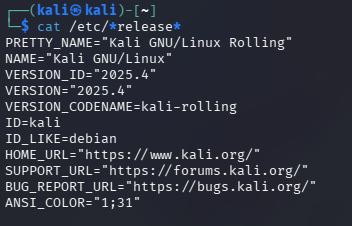

- скриншот вывода результатов команды `ls -la` (в основной системе):

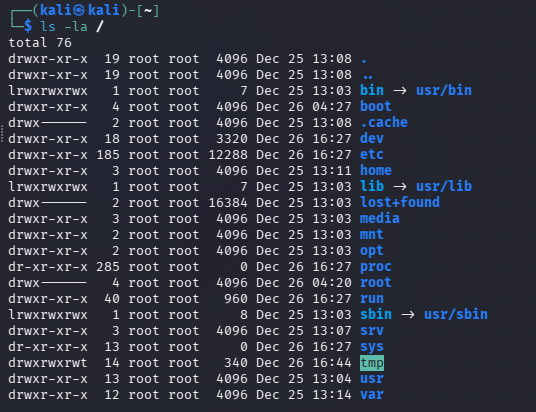

---

## Задание 3. Dockerfile

### Описание задания

Вы запустили контейнер на основе готового образа из общедоступного репозитория Docker HUB и вручную выполнили отдельные 
команды для решения простых задач. Далее необходимо подготовить образ, который будет содержать заложенные директивы. 
Они будут автоматически выполнены при запуске контейнера. 
Директивы прописываются в специальном конфигурационном файле Dockerfile.

### Результат выполненного задания

- Cкриншот вывода содержимого файла скрипта `cat mybash1.sh`:

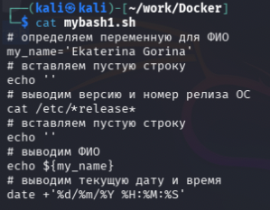

- скриншот вывода содержимого файла Dockerfile `cat Dockerfile`:

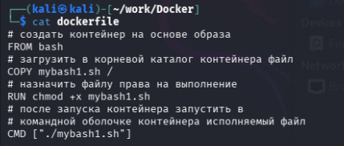

- скриншот результатов сборки образа `sudo docker build -t imagebash1 .` искриншот результатов запуска контейнера `sudo docker run –rm imagebash1`:

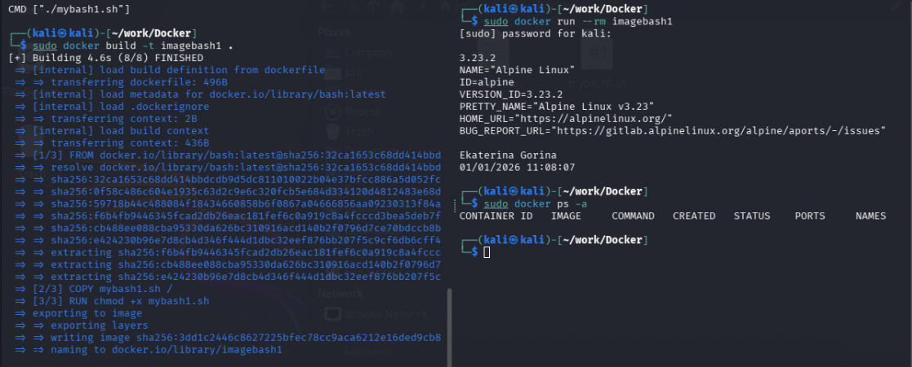

- скриншот результатов запуска скрипта в основной системе ./mybash1.sh:

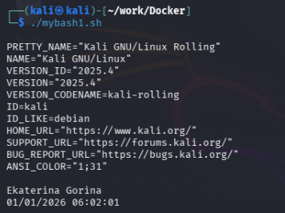

---

## Задание 4. Docker-compose

### Описание задания

Необходимо реализовать запуск подготовленной связки контейнеров с использованием конфигурационного файла docker-compose.yml.

### Результат выполненного задания

- Cкриншот вывода содержимого подготовленного файла `index.html`, содержащий Ф.И.:

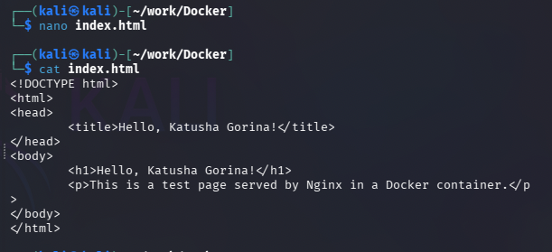

- скриншот вывода содержимого подготовленного файла `docker-compose.yml`:

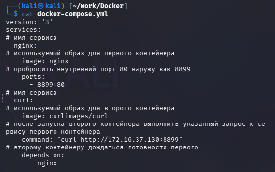

- скриншот результатов запуска подготовленной связки контейнеров:

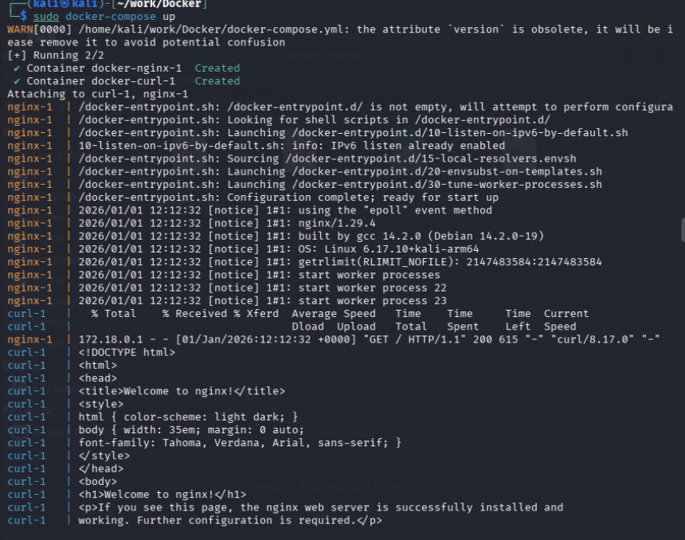

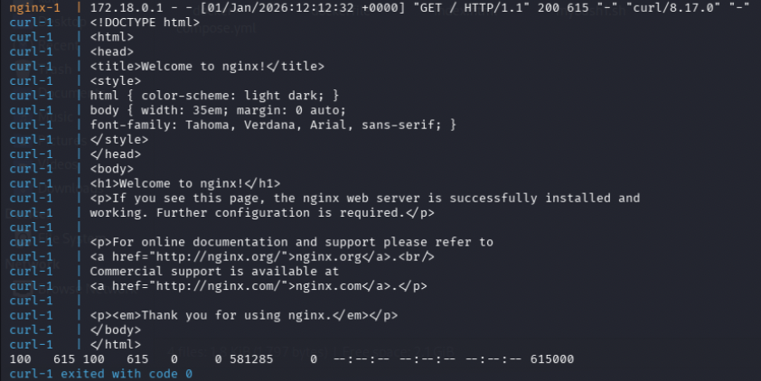

- скриншот первоначальной титульной страницы Nginx при подключении браузером к контейнеру:

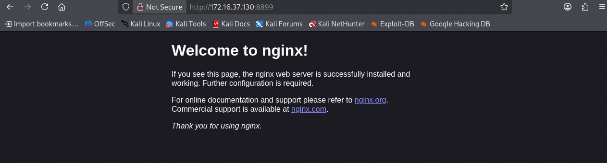

- скриншот запуска связки контейнеров после замены файла index.html в контейнере, содержащий Ф.И.:

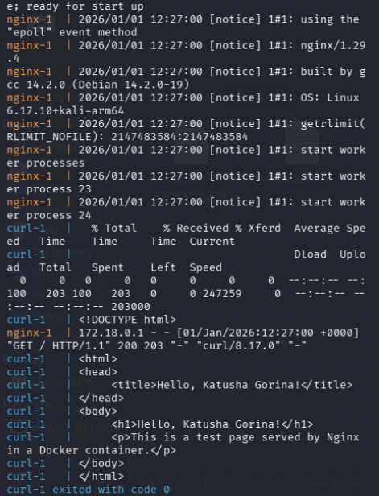

- скриншот варианта титульной страницы Nginx при подключении браузером к контейнеру, содержащий Ф.И.:

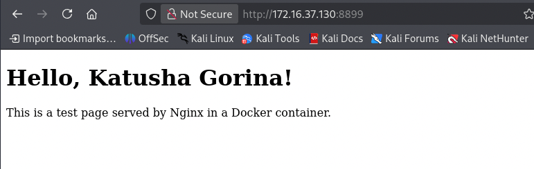

- скриншот вывода результатов команды остановки связки контейнеров:

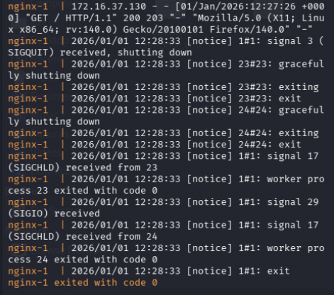
